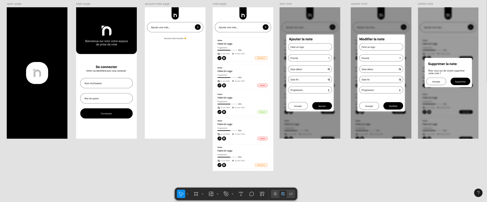

# Noto

**Noto** est une application mobile Flutter conçue pour simplifier la prise de notes au quotidien. Elle offre une interface intuitive, une gestion des priorités, une connexion sécurisée et un stockage local performant via SQLite.

---

## 🚀 Fonctionnalités clés

- **Gestion des notes** : création, modification, suppression avec dates de début/fin et suivi de progression.
- **Priorités colorées** : visualisation rapide selon la priorité (Haute, Moyenne, Basse).
- **Interface fluide et moderne** : design épuré avec Flutter.
- **Connexion utilisateur sécurisée** : gestion des utilisateurs avec authentification simple.
- **Stockage local optimisé** : base de données SQLite intégrée.
- **Internationalisation** : formatage des dates en français.

---
## 🖼️ Aperçu

    

